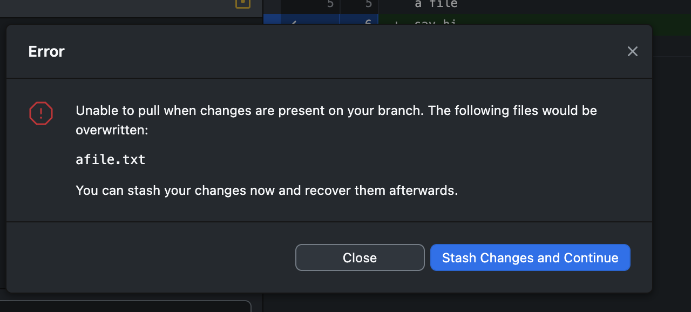
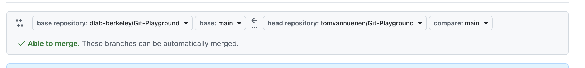

# Week 3: from local version control to working together

Have [GitHub Desktop](https://desktop.github.com/download/) installed and signed
in, and VS Code ready.

Keep the [Git and GitHub glossary](3_git_github_glossary.md) handy for unfamiliar
terms.

1. [How git thinks](#1-how-git-thinks)
2. [Keep a local history](#2-keep-a-local-history)
3. [Put the same repository on GitHub](#3-put-the-same-repository-on-github)
4. [Propose and review changes](#4-propose-and-review-changes)
5. [Use the workflow in your team project](#5-use-the-workflow-in-your-team-project)

## 1. How git thinks

**What is Git?** Git is a free, open-source distributed version control system designed to track changes in source code and manage project files over time.

A **repository** is just a project folder whose files and history are tracked by Git.

A **commit** is a named checkpoint, or snapshot, of your project's files at a specific point in time. Commits allow you to track your project's history and revert your code back to that exact state if something breaks later on.

## 2. Keep a local history

### Create a repository

1. In GitHub Desktop, select **File → New Repository**. On the welcome screen, the
   equivalent option is **Create a New Repository on your Local Drive**.
2. Name it `week3-practice`. Choose a local location you can find again,
   outside any existing repository.
3. Select **Initialize this repository with a README**. Leave the ignore and
   license choices at their defaults for this small exercise. Create it.
4. Open **History**. Desktop has made an initial commit. Check **Current
   Repository** and **Current Branch** at the top; we will call the default
   branch `main` throughout this guide. If yours has a different name, use
   that name in the personal practice steps.

The repository exists on your computer. We have not published it to GitHub.

### Save, inspect the diff, commit

1. Select **Repository → Open in Visual Studio Code**, or open the repository
   folder in your editor. In `README.md`, add something!
2. Save the file. In GitHub Desktop, open **Changes** and select `README.md`.
   The **diff** shows added lines in green and removed lines in red. Read the
   actual text: is this the change you intended?
3. Leave the checkbox beside this file selected. Checked changes are selected
   for the commit; Git calls this staging.
4. Enter `Explain the purpose of this practice repository` in **Summary**,
   then select **Commit to main**.
5. Open **History** and select your commit. Its message and diff record what
   you changed. There should now be no uncommitted changes under **Changes**.

**Your turn:** add another sentence to the README. Save, inspect,
and make a second commit with a message that explains this addition. Compare
the two commits in History.

A useful commit has one clear purpose. A commit message like `Add the next practice step` 
tells a future reader more than `changes`. One coherent change can involve several
files, but unrelated edits should not be bundled together.

**Question:** Where are your two commits? Can someone see them on GitHub yet?

Now do tab 1 of [How Git Thinks](https://macss-berkeley.github.io/compss-211a/interactives/week03-how-git-thinks.html#basics).

### A little Markdown

The `.md` file is plain text. GitHub renders its headings, paragraphs, lists,
and links. For example:

```markdown
## Next steps

- Find a possible data source.
- Read the [course repository](https://github.com/macss-berkeley/compss-211a).
```

A project's README should help someone find the question, data, code, and run
instructions, and understand the method and its limits. We will see the
rendered version after publishing.

## 3. Put the same repository on GitHub

### Publish, then push another change

1. In Desktop, select **Publish repository**. Use your own account and the name
   `week3-practice` (or a new name if you already used that one).
2. For this practice repository, deselect **Keep this code private**. This means 
   it can be viewed by others.
3. Select **Publish Repository**, then **Repository → View on GitHub**.
   Find your README and commit history in the browser.

Github Desktop creates the remote repository and connects your existing local copy
to it. You do not need to create a second repository in the browser or link
the two manually. See [GitHub's publishing guide](https://docs.github.com/en/desktop/overview/creating-your-first-repository-using-github-desktop#part-4-publishing-your-repository-to-github).

4. Locally, add a sentence like `My repository now has an online copy` to the README. Save
   and commit, then refresh GitHub **before pushing**. Is the sentence there?
5. Select **Push origin** and refresh GitHub again. Find the sentence and its
   commit. `origin` is the usual name for this repository's remote connection.

| Action | What changes? |
| --- | --- |
| Save | The working file on your computer. |
| Commit | Selected changes enter local Git history. |
| Push | Local commits reach GitHub. |

**Question:** Maya saves a paragraph and commits it. Can Luis see it on GitHub?
What action is still needed?

### Find your way around GitHub

Use your avatar at the top right to find **Your profile** (your public page and
pinned work), **Your repositories** (your projects), and **Settings** (your
account). You can edit public profile details such as your name and bio in
account settings. [Example avatar menu](../../img/github-avatar-menu.png).

Inside a repository, **Code** shows files, the **branch** selector switches
which branch you view, and **Pull requests** lists proposed changes (more on that below). 
Repos have their own **Settings** tab, which controls that repository, including 
collaborators, deletion, and Github Pages (free website! More on that later as well).

Account settings and repository settings are different places.

### Bring an online change back: Fetch and Pull

Make sure you have no uncommitted local edits and no commits waiting to be pushed.

1. On GitHub, open your README on `main` and select the pencil/edit button.
   Add `This sentence was added on GitHub.` Use **Commit changes** to record
   the change directly on `main` in this personal practice repository.
2. Look at the file in your local editor. It still shows the old version.
3. In Desktop, check that you are on `main`, then select **Fetch origin**.
   Fetch checks for remote commits; it does not change your working files.
4. Select **Pull origin** when offered. Look at the file and History locally:
   the online change has arrived. [GitHub's syncing guide](https://docs.github.com/en/desktop/working-with-your-remote-repository-on-github-or-github-enterprise/syncing-your-branch-in-github-desktop).

**Question:** Luis pushed a new change to the team's repository.
Maya still sees the old question locally. What should she check and do next?

### Pull fail, stashing, resolving a conflict

Preview: [tab 2 of How Git Thinks](https://macss-berkeley.github.io/compss-211a/interactives/week03-how-git-thinks.html#pull-first) shows the committed version of this situation, a refused push fixed by pulling, and [tab 3](https://macss-berkeley.github.io/compss-211a/interactives/week03-how-git-thinks.html#conflict) shows resolving the same conflict.

Imagine you are drafting your team project's next step while a teammate edits the
same sentence. We will play both roles: your editor has your unfinished
draft, and we'll make an edit on GitHub to simulate your teammate's contribution.

Use your **personal `week3-practice` repository**, on `main`. Start with no
uncommitted changes, no commits waiting to be pushed, and no existing stash.
Fetch and pull first so your local and GitHub copies agree.

1. **Give both copies the same starting point.** Locally, create
   `next-step.md` in the repository's top folder with this one line:

   ```text
   Next step: choose a data source.
   ```

   Save, commit with the message `Add the next step`, and push. Open the file
   on GitHub and check that you see that exact sentence.
2. **Start an unfinished local edit.** In your editor, replace the line with
   `Next step: compare two data sources.` Save, but **do not commit**.
   Check that Desktop lists `next-step.md` under **Changes**.
3. **Play the teammate on GitHub.** In the browser, edit the same file on
   `main`. Replace its line with `Next step: check the data license.` Commit
   directly to `main` with the message `Check the data license`.
   Leave your local draft uncommitted.
4. **Try to pull.** In Desktop, select **Fetch origin**, then **Pull origin**.
   It should stop because pulling would overwrite your saved local edit.
   Read the warning together: which file is affected, and what is Git
   protecting? 

   

5. **Set the draft aside.** Select **Stash Changes and Continue**. If GitHub Desktop
   still offers **Pull origin**, select it. Open the local file: it should now
   say `Next step: check the data license.` Your draft is in the stash.
6. **Bring the draft back.** Stay on `main`. In GitHub Desktop's **Changes** tab,
   select **Stashed Changes → Restore**. This time the two versions conflict:
   they changed the same original line differently. Open `next-step.md` in
   VS Code and inspect both versions. The labels may vary, but the conflict
   markers look like this:

   ```text
   <<<<<<< Updated upstream
   Next step: check the data license.
   =======
   Next step: compare two data sources.
   >>>>>>> Stashed changes
   ```

7. **Decide what the sentence should say.** To resolve the issue: 
   In the editor, replace the whole conflict block, including
   the marker lines, with an agreed sentence. For this exercise, use:

   ```text
   Next step: compare two data sources and check their licenses.
   ```

   Save. If VS Code opens a merge editor, put this sentence in its result
   and complete the resolution.
8. **Record and share the result.** Return to GitHub Desktop and check that the
   conflict is resolved. Inspect the diff, include `next-step.md`, and commit
   with `Agree on the next step`. Push, then refresh the file on GitHub to
   verify the agreed sentence. GitHub Desktop should show no uncommitted changes.
   If the exercise's draft still appears under **Stashed Changes**, discard
   that stash only after checking the committed and pushed result.

**Commit or stash?** Commit when the edits form a useful checkpoint. Stash
when they are unfinished and you need to set them aside briefly. Either route
can still lead to a conflict when edits overlap. A stash stays on this computer;
it is not pushed to GitHub. [GitHub's stashing guide](https://docs.github.com/en/desktop/making-changes-in-a-branch/stashing-changes-in-github-desktop).

**Question:** Why did pulling work after stashing? Why did restoring cause
a conflict? 

If the expected warning or conflict does not appear, check that both edits
replaced the **same line in the same file**, that the online edit was committed,
and that the local edit was saved but not committed.

### Get this week's course files

Recall that your course folder is a local copy of the teaching repository. 
When instructors update the materials on GitHub, you need to **pull** those 
changes into your copy. Use this routine at the start of each week.

1. Save any open notebooks or other files in VS Code.
2. In Desktop, select `compss-211a` under **Current Repository** and check that
   **Current Branch** is `main`. If your existing course folder is not listed,
   use **File → Add Local Repository** and choose that folder. Use
   **Repository → View on GitHub** to check that it connects to
   [macss-berkeley/compss-211a](https://github.com/macss-berkeley/compss-211a).
   Ask for help if the repository or branch differs.
3. Inspect **Changes** for your own saved edits. Select **Fetch origin** to
   check for updates; fetching does not change your working files. Check
   whether Desktop also shows local commits waiting to be pushed.
4. If you have no local edits or commits waiting to be pushed, select
   **Pull origin** when offered. If you have your own work, read the guidance
   below before pulling. If there are no incoming changes, there is nothing
   to pull.
5. Open `lessons/week03_github-desktop/1_github_basics.md` in your local course
   folder. Check that this section is there; GitHub Desktop's **History** also shows
   the commits you received.

**If you have local work:** inspect what you changed before deciding how to
update. For unfinished, uncommitted edits, the [stash exercise above](#make-a-pull-fail-then-stash-and-resolve-a-conflict)
shows how to set them aside, pull, and restore them. Ask for help applying this
to your notebooks and checking the restored work. If you have already committed
your changes, ask for help reconciling the histories; stashing does not set
those commits aside.

Keep your work if an update is blocked; do not discard changes just to make
the pull succeed. You can continue following the lesson on GitHub while we
help update your local copy.

## 4. Propose and review changes

Optional preview: [tab 4 of How Git Thinks](https://macss-berkeley.github.io/compss-211a/interactives/week03-how-git-thinks.html#branches) walks through the same branch, pull request, merge, and pull sequence in about five minutes.

### See what a branch does

`main` is the primary, canonical version of a repo. A **branch** is a separate, isolated 
line of development. Branches work locally and remotely.

1. In your practice repository, select `main`, fetch, and pull if offered.
2. Select **Current Branch → New Branch**. Name it `add-question` and create
   it from `main` before editing.
3. Add a file named `question.md` containing a question you might investigate.
   Save, inspect the diff, and commit on `add-question`.
4. With no uncommitted changes, switch to `main`. Look in the editor/file manager: the new
   file is absent. Switch back to `add-question`: it returns.

**Question:** Did creating this branch make a second project folder? 

### Open and merge your own pull request

Your `add-question` branch contains `question.md`; `main` does not. A **pull
request (PR)** proposes bringing that change into `main`. Usually this is done 
in team settings, where people propose changes to a codebase. 
For now, let's practice on our own repo.

1. In GitHub Desktop, select `add-question`, then **Publish branch**. Open
   **Repository → View on GitHub**.
2. On GitHub, choose **Pull requests → New pull request**. Select **base:
   `main`** (where the change goes) and **compare: `add-question`** (where it
   comes from). If repository selectors are shown, both should be your own
   `week3-practice` repository. Select **Create pull request**, use the title
   `Add a project question`, briefly explain your question, and submit the PR.
3. Open **Files changed**. Check that the proposed change is the addition of
   `question.md`. 
4. Return to the PR's **Conversation** tab, select **Merge pull request**, and
   confirm. Open your repository's **Code** tab on `main`: `question.md` should
   now be there.
5. Back in GitHub Desktop, switch to `main`, fetch, and pull. Open `question.md`
   locally. You can delete `add-question` after its work is merged.

| Action | What happens to `main`? |
| --- | --- |
| Publish `add-question` | Nothing. The branch is now also on GitHub. |
| Open and inspect the PR | Nothing. The change is still a proposal. |
| Merge the PR | `main` on GitHub gains `question.md`. |
| Pull while on local `main` | Your computer's `main` receives that change. |

**Merge or close?** Merging accepts the changes and closes the PR as merged.
The separate **Close pull request** button closes the proposal without merging
its changes. 

### Branch, clone, and fork: what is the difference?

| Action | What it creates | Example |
| --- | --- | --- |
| [Branch](3_git_github_glossary.md#branch) | Another line of development within one repository | Create `add-question` alongside `main`. |
| [Clone](3_git_github_glossary.md#clone) | A local copy of an existing repository, with its history | Download the team repository into GitHub Desktop to work on your computer. |
| [Fork](3_git_github_glossary.md#fork) | A separate repository on GitHub, linked to the original | Create `tomvannuenen/Git-Playground` from `dlab-berkeley/Git-Playground`. |

**Forking** lets you work on your own copy of someone else's project, often
because you do not have permission to push to their repository. Changes in
your fork do not automatically change the original. To contribute them back,
you open a **pull request** from a branch in your fork to a branch in the original
repository. Someone with permission there can review and merge it.

Here is an example: Tom proposes a change from his fork back to D-Lab.



**Reading GitHub's comparison bar:** each side names a repository and a branch
inside it. The proposed changes go **from the right into the left**.

| GitHub label | Meaning | Example: proposing a change back to D-Lab |
| --- | --- | --- |
| [Base repository](3_git_github_glossary.md#base-repository) | The repository you want to change | `dlab-berkeley/Git-Playground` |
| [Base](3_git_github_glossary.md#base-branch) | The branch that would receive the changes | `main` in D-Lab's repository |
| [Head repository](3_git_github_glossary.md#head-repository) | The repository containing your proposed changes | `tomvannuenen/Git-Playground` |
| [Compare](3_git_github_glossary.md#compare-branch-or-head-branch) | The branch containing your proposed changes; also called the head branch | `main` in Tom's fork |

That example asks: **"Bring the changes from Tom's `main` into D-Lab's
`main`."** Both branches are called `main`, but they belong to different
repositories and can contain different work.

**Able to merge** means Git sees no merge conflict; it does not mean someone
has reviewed or accepted the change. See GitHub's
[guide to PRs from forks](https://docs.github.com/en/pull-requests/how-tos/create-pull-requests/creating-a-pull-request-from-a-fork).

### Contribute to the course: fork and propose an improvement

As one example of forking, you can **suggest changes in our course materials.**
Choose an instruction you found confusing, add an example to a glossary
definition, fix a typo or broken link, or add a short troubleshooting tip.

If you are unsure what to change, add a concrete example to a glossary definition 
that you found difficult to understand.

You can do this exercise entirely in your browser.

1. **Create your fork.** Open the
   [teaching repository](https://github.com/macss-berkeley/compss-211a) and select
   **Fork**. Choose your account as **Owner**, keep the name `compss-211a`,
   leave **Copy the main branch only** selected, and choose **Create fork**.
   Check that the repository name now starts with your username. If you
   already have a fork, open it on `main` and use **Sync fork → Update branch**
   if offered to bring in the latest course materials.
2. **Create a branch in your fork.** On its **Code** tab, check that `main` is
   selected. Open the branch dropdown, type `clarify-instructions`, and select
   **Create branch** from `main`. Check that the dropdown now shows your new
   branch.
3. **Make your improvement.** In your fork, browse to
   `lessons/week03_github-desktop/` and open 
   `3_git_github_glossary.md`. Select the pencil/edit button, make your change,
   and use **Preview** to check the formatting.
4. **Commit on your branch.** Select **Commit changes**, write a message that
   describes your improvement, and commit directly to `clarify-instructions`.
   A commit made in the browser is already on GitHub; there is no separate GitHub
   Desktop push in this exercise.
5. **Propose it to the course.** Return to the
   [original teaching repository](https://github.com/macss-berkeley/compss-211a),
   select **Pull requests → New pull request**, then **compare across forks**
   if the repository selectors are hidden. Set the four selectors as follows,
   replacing `YOUR-USERNAME` with your GitHub username:

   | Selector | Choose |
   | --- | --- |
   | **Base repository** — where the change should go | `macss-berkeley/compss-211a` |
   | **Base** — the branch to update | `main` |
   | **Head repository** — where your change comes from | `YOUR-USERNAME/compss-211a` |
   | **Compare** — the branch containing your change | `clarify-instructions` |

6. **Check and open the PR.** Read the diff: it should contain only your
   intended edit. Select **Create pull request**, give it a descriptive title,
   and explain what was confusing or incorrect and how your edit helps.
   Submit the PR. Check that it appears in the teaching repository's
   **Pull requests** tab.
7. **Respond to the instructor's review.** Read any feedback under
   **Conversation**. If a revision is requested, return to the same file on
   `clarify-instructions` in your fork and commit the edit. The existing PR
   updates automatically. The instructor can then review it again.
